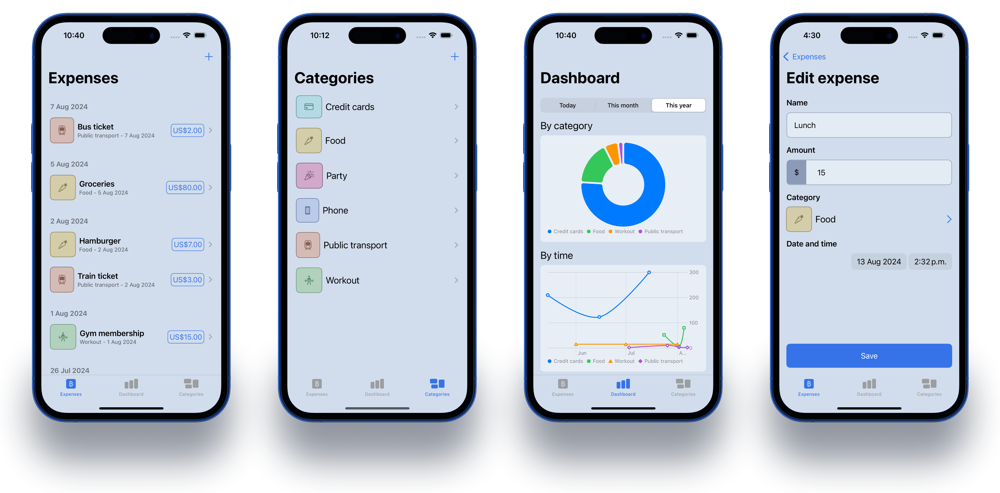

# Xpenzo

## Overview

**Xpenzo** helps you track, categorize an visualize your expenses to help you improve your expending habits.

## Features

- **Expenses tracking**: Track your expenses on a simple and intuitive UI.
- **Categorize expenses**: Add personalized icons and colors to your category expenses.
- **Visualize**: Visualize expenses by categories and date ranges.

## Tech Stack

MVVM architecture using the following SDKs:

- SwiftUI
- SwiftData
- Swift Charts

## Contributing

Contributions are welcome! If you have any ideas for improvements or new features, feel free to fork the repository and submit a pull request.

## License

This project is licensed under the [MIT License](LICENSE.txt).